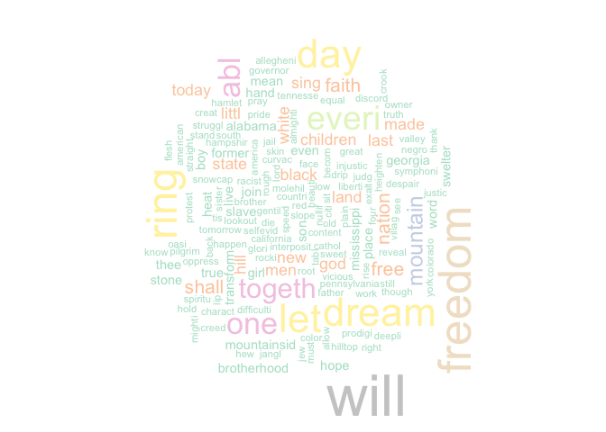

Module 5 Technique Practice
================
Justin Ehringhaus
Last edited August 12, 2022 at 12:33

-   <a href="#importing-packages" id="toc-importing-packages">Importing
    Packages</a>
-   <a href="#reading-and-loading-the-text-to-mine"
    id="toc-reading-and-loading-the-text-to-mine">Reading and Loading the
    Text to Mine</a>
-   <a href="#removing-wordssymbols" id="toc-removing-wordssymbols">Removing
    Words/Symbols</a>
-   <a href="#removing-stop-words-and-stemming"
    id="toc-removing-stop-words-and-stemming">Removing Stop Words and
    Stemming</a>
-   <a href="#term-document-matrix"
    id="toc-term-document-matrix">Term-Document Matrix</a>
-   <a href="#visualizing-most-common-words"
    id="toc-visualizing-most-common-words">Visualizing Most Common Words</a>
-   <a href="#more-text-mining-methods"
    id="toc-more-text-mining-methods">More Text Mining Methods</a>

## Importing Packages

``` r
library(pacman)
p_load(tm)
p_load(SnowballC)
p_load(wordcloud)
p_load(RColorBrewer)
p_load(tidyverse)
```

## Reading and Loading the Text to Mine

``` r
filePath <- url("http://www.sthda.com/sthda/RDoc/example-files/martin-luther-king-i-have-a-dream-speech.txt")
text <- readLines(filePath)

# Load the data as a corpus
docs <- Corpus(VectorSource(text))
inspect(docs)
```

    ## <<SimpleCorpus>>
    ## Metadata:  corpus specific: 1, document level (indexed): 0
    ## Content:  documents: 46
    ## 
    ##  [1]                                                                                                                                                                                                                                                                                                                                                                                                               
    ##  [2] And so even though we face the difficulties of today and tomorrow, I still have a dream. It is a dream deeply rooted in the American dream.                                                                                                                                                                                                                                                                   
    ##  [3]                                                                                                                                                                                                                                                                                                                                                                                                               
    ##  [4] I have a dream that one day this nation will rise up and live out the true meaning of its creed:                                                                                                                                                                                                                                                                                                              
    ##  [5]                                                                                                                                                                                                                                                                                                                                                                                                               
    ##  [6] We hold these truths to be self-evident, that all men are created equal.                                                                                                                                                                                                                                                                                                                                      
    ##  [7]                                                                                                                                                                                                                                                                                                                                                                                                               
    ##  [8] I have a dream that one day on the red hills of Georgia, the sons of former slaves and the sons of former slave owners will be able to sit down together at the table of brotherhood.                                                                                                                                                                                                                         
    ##  [9]                                                                                                                                                                                                                                                                                                                                                                                                               
    ## [10] I have a dream that one day even the state of Mississippi, a state sweltering with the heat of injustice, sweltering with the heat of oppression, will be transformed into an oasis of freedom and justice.                                                                                                                                                                                                   
    ## [11]                                                                                                                                                                                                                                                                                                                                                                                                               
    ## [12] I have a dream that my four little children will one day live in a nation where they will not be judged by the color of their skin but by the content of their character.                                                                                                                                                                                                                                     
    ## [13]                                                                                                                                                                                                                                                                                                                                                                                                               
    ## [14] I have a dream today!                                                                                                                                                                                                                                                                                                                                                                                         
    ## [15]                                                                                                                                                                                                                                                                                                                                                                                                               
    ## [16] I have a dream that one day, down in Alabama, with its vicious racists, with its governor having his lips dripping with the words of interposition and nullification, one day right there in Alabama little black boys and black girls will be able to join hands with little white boys and white girls as sisters and brothers.                                                                             
    ## [17]                                                                                                                                                                                                                                                                                                                                                                                                               
    ## [18] I have a dream today!                                                                                                                                                                                                                                                                                                                                                                                         
    ## [19]                                                                                                                                                                                                                                                                                                                                                                                                               
    ## [20] I have a dream that one day every valley shall be exalted, and every hill and mountain shall be made low, the rough places will be made plain, and the crooked places will be made straight; and the glory of the Lord shall be revealed and all flesh shall see it together.                                                                                                                                 
    ## [21]                                                                                                                                                                                                                                                                                                                                                                                                               
    ## [22] This is our hope, and this is the faith that I go back to the South with.                                                                                                                                                                                                                                                                                                                                     
    ## [23]                                                                                                                                                                                                                                                                                                                                                                                                               
    ## [24] With this faith, we will be able to hew out of the mountain of despair a stone of hope. With this faith, we will be able to transform the jangling discords of our nation into a beautiful symphony of brotherhood. With this faith, we will be able to work together, to pray together, to struggle together, to go to jail together, to stand up for freedom together, knowing that we will be free one day.
    ## [25]                                                                                                                                                                                                                                                                                                                                                                                                               
    ## [26] And this will be the day, this will be the day when all of God s children will be able to sing with new meaning:                                                                                                                                                                                                                                                                                              
    ## [27]                                                                                                                                                                                                                                                                                                                                                                                                               
    ## [28] My country  tis of thee, sweet land of liberty, of thee I sing.                                                                                                                                                                                                                                                                                                                                               
    ## [29] Land where my fathers died, land of the Pilgrim s pride,                                                                                                                                                                                                                                                                                                                                                      
    ## [30] From every mountainside, let freedom ring!                                                                                                                                                                                                                                                                                                                                                                    
    ## [31] And if America is to be a great nation, this must become true.                                                                                                                                                                                                                                                                                                                                                
    ## [32] And so let freedom ring from the prodigious hilltops of New Hampshire.                                                                                                                                                                                                                                                                                                                                        
    ## [33] Let freedom ring from the mighty mountains of New York.                                                                                                                                                                                                                                                                                                                                                       
    ## [34] Let freedom ring from the heightening Alleghenies of Pennsylvania.                                                                                                                                                                                                                                                                                                                                            
    ## [35] Let freedom ring from the snow-capped Rockies of Colorado.                                                                                                                                                                                                                                                                                                                                                    
    ## [36] Let freedom ring from the curvaceous slopes of California.                                                                                                                                                                                                                                                                                                                                                    
    ## [37]                                                                                                                                                                                                                                                                                                                                                                                                               
    ## [38] But not only that:                                                                                                                                                                                                                                                                                                                                                                                            
    ## [39] Let freedom ring from Stone Mountain of Georgia.                                                                                                                                                                                                                                                                                                                                                              
    ## [40] Let freedom ring from Lookout Mountain of Tennessee.                                                                                                                                                                                                                                                                                                                                                          
    ## [41] Let freedom ring from every hill and molehill of Mississippi.                                                                                                                                                                                                                                                                                                                                                 
    ## [42] From every mountainside, let freedom ring.                                                                                                                                                                                                                                                                                                                                                                    
    ## [43] And when this happens, when we allow freedom ring, when we let it ring from every village and every hamlet, from every state and every city, we will be able to speed up that day when all of God s children, black men and white men, Jews and Gentiles, Protestants and Catholics, will be able to join hands and sing in the words of the old Negro spiritual:                                             
    ## [44] Free at last! Free at last!                                                                                                                                                                                                                                                                                                                                                                                   
    ## [45]                                                                                                                                                                                                                                                                                                                                                                                                               
    ## [46] Thank God Almighty, we are free at last!

The `readLines` function reads text from a connection (a url, in this
case). It is necessary to pass a Source object to the `Corpus` function
from the `tm` package to generate a corpus, and thus we will pass the
character vector `text` first through `VectorSource` and then through
`Corpus`, which is assigned to `docs` and holds each document as well as
some associated metadata.

## Removing Words/Symbols

``` r
toSpace <- content_transformer(function (x , pattern ) gsub(pattern, " ", x))
docs <- tm_map(docs, toSpace, "/")
docs <- tm_map(docs, toSpace, "@")
docs <- tm_map(docs, toSpace, "\\|")
```

The custom `toSpace` function above replaces the characters specified in
the `pattern` parameter with a space. The above code examines and
removes all instances of slashes and at-marks. This function can be
useful to make purposeful deletions when, for instance, the process of
lemmitization and stemming fails to remove a certain word or occurrence
of a character.

``` r
# Convert the text to lower case
docs <- tm_map(docs, content_transformer(tolower))
# Remove numbers
docs <- tm_map(docs, removeNumbers)
# Remove punctuations
docs <- tm_map(docs, removePunctuation)
# Eliminate extra white spaces
docs <- tm_map(docs, stripWhitespace)
```

The above changes applied by the `tm_map` function are self-explanatory.
The first converts the entire corpus to lower case, the second removes
instances of numbers, the third removes instances of punctuation, and
the last removes any superfluous instances of white space beyond one
character.

## Removing Stop Words and Stemming

``` r
stopwords("en")
```

    ##   [1] "i"          "me"         "my"         "myself"     "we"        
    ##   [6] "our"        "ours"       "ourselves"  "you"        "your"      
    ##  [11] "yours"      "yourself"   "yourselves" "he"         "him"       
    ##  [16] "his"        "himself"    "she"        "her"        "hers"      
    ##  [21] "herself"    "it"         "its"        "itself"     "they"      
    ##  [26] "them"       "their"      "theirs"     "themselves" "what"      
    ##  [31] "which"      "who"        "whom"       "this"       "that"      
    ##  [36] "these"      "those"      "am"         "is"         "are"       
    ##  [41] "was"        "were"       "be"         "been"       "being"     
    ##  [46] "have"       "has"        "had"        "having"     "do"        
    ##  [51] "does"       "did"        "doing"      "would"      "should"    
    ##  [56] "could"      "ought"      "i'm"        "you're"     "he's"      
    ##  [61] "she's"      "it's"       "we're"      "they're"    "i've"      
    ##  [66] "you've"     "we've"      "they've"    "i'd"        "you'd"     
    ##  [71] "he'd"       "she'd"      "we'd"       "they'd"     "i'll"      
    ##  [76] "you'll"     "he'll"      "she'll"     "we'll"      "they'll"   
    ##  [81] "isn't"      "aren't"     "wasn't"     "weren't"    "hasn't"    
    ##  [86] "haven't"    "hadn't"     "doesn't"    "don't"      "didn't"    
    ##  [91] "won't"      "wouldn't"   "shan't"     "shouldn't"  "can't"     
    ##  [96] "cannot"     "couldn't"   "mustn't"    "let's"      "that's"    
    ## [101] "who's"      "what's"     "here's"     "there's"    "when's"    
    ## [106] "where's"    "why's"      "how's"      "a"          "an"        
    ## [111] "the"        "and"        "but"        "if"         "or"        
    ## [116] "because"    "as"         "until"      "while"      "of"        
    ## [121] "at"         "by"         "for"        "with"       "about"     
    ## [126] "against"    "between"    "into"       "through"    "during"    
    ## [131] "before"     "after"      "above"      "below"      "to"        
    ## [136] "from"       "up"         "down"       "in"         "out"       
    ## [141] "on"         "off"        "over"       "under"      "again"     
    ## [146] "further"    "then"       "once"       "here"       "there"     
    ## [151] "when"       "where"      "why"        "how"        "all"       
    ## [156] "any"        "both"       "each"       "few"        "more"      
    ## [161] "most"       "other"      "some"       "such"       "no"        
    ## [166] "nor"        "not"        "only"       "own"        "same"      
    ## [171] "so"         "than"       "too"        "very"

``` r
# Remove common English stopwords
docs <- tm_map(docs, removeWords, stopwords("english"))

# Remove your own stop word
docs <- tm_map(docs, removeWords, c("howdy"))

# Text stemming
docs <- tm_map(docs, stemDocument)
```

The above changes applied by the `tm_map` function require some further
explanation. Stop words are words carrying little information. The first
snippet of code above shows a full list of English stop words, each of
which has been found not greatly alter the meaning of a document.

Next, I demonstrate stemming, or the process of cleaning words to remove
them of their superfluous endings, which is for the purpose of reducing
the variety of words included in the corpus. For example: “difficulty”
and “difficulties” share the same meaning but different endings.
Stemming chops the endings off to standardize this word as “difficulti.”

## Term-Document Matrix

``` r
TermDocumentMatrix(docs)
```

    ## <<TermDocumentMatrix (terms: 162, documents: 46)>>
    ## Non-/sparse entries: 277/7175
    ## Sparsity           : 96%
    ## Maximal term length: 12
    ## Weighting          : term frequency (tf)

``` r
dtm <- TermDocumentMatrix(docs)
# a glimpse at the matrix
inspect(dtm[1:5, 1:5])
```

    ## <<TermDocumentMatrix (terms: 5, documents: 5)>>
    ## Non-/sparse entries: 6/19
    ## Sparsity           : 76%
    ## Maximal term length: 10
    ## Weighting          : term frequency (tf)
    ## Sample             :
    ##             Docs
    ## Terms        1 2 3 4 5
    ##   american   0 1 0 0 0
    ##   deepli     0 1 0 0 0
    ##   difficulti 0 1 0 0 0
    ##   dream      0 3 0 1 0
    ##   even       0 1 0 0 0

``` r
m <- as.matrix(dtm)
v <- sort(rowSums(m), decreasing=TRUE)
d <- data.frame(word = names(v), freq = v)
head(d, 10)
```

    ##            word freq
    ## will       will   17
    ## freedom freedom   13
    ## ring       ring   12
    ## dream     dream   11
    ## day         day   11
    ## let         let   11
    ## everi     everi    9
    ## one         one    8
    ## abl         abl    8
    ## togeth   togeth    7

The `TermDocumentMatrix` function converts the `docs` vector into a
matrix where each word is compared to each document and counts of
whether the word is contained in each document are tabulated. This
process facilitates further mathematical operations such as finding the
total number of occurrences of each word in the corpus. Sparsity
measures the proportion of elements in the matrix that are assigned a
zero versus those assigned a value. Thus, we can see the overall
sparsity of `dtm` is 96% whereas the sparsity of the first five terms in
`dtm` is 76%.

`TermDocumentMatrix` holds various metadata, so my next step is to
convert `dtm` to a simple matrix using the `as.matrix` function to view
rows of unique words, columns of documents, and values of occurrences.
Each row can be summed and then sorted for a descending count of total
occurrences of each word in the corpus, which is then converted to a
dataframe to name the respective columns.

## Visualizing Most Common Words

``` r
set.seed(1234)
wordcloud(words = d$word, freq = d$freq, min.freq = 1,
          max.words = 200, random.order = TRUE, rot.per=0.35, 
          colors = brewer.pal(8, "Pastel2"))
```

<!-- -->

The `wordcloud` function accepts character vectors of words and
associated frequencies to plot most frequently occurring words with
larger fonts and less frequently occurring words with smaller fonts.
Customization can be applied to control the proportion of words with 90
degree rotation (`rot.per`), the color palette (`colors`), the ordering
(`random.order`), and more.

I have opted to use random ordering and a pastel color set to emphasize
the enthusiastic, aspirational qualities of Martin Luther King Jr.’s
original speech.

## More Text Mining Methods

``` r
findFreqTerms(dtm, lowfreq = 4)
```

    ##  [1] "dream"    "day"      "nation"   "one"      "will"     "abl"     
    ##  [7] "togeth"   "freedom"  "everi"    "mountain" "shall"    "faith"   
    ## [13] "free"     "let"      "ring"

`findFreqTerms` is self-explanatory: it finds frequent terms in a corpus
given a term-document matrix.

``` r
d %>% filter(freq >= 4)
```

    ##              word freq
    ## will         will   17
    ## freedom   freedom   13
    ## ring         ring   12
    ## dream       dream   11
    ## day           day   11
    ## let           let   11
    ## everi       everi    9
    ## one           one    8
    ## abl           abl    8
    ## togeth     togeth    7
    ## mountain mountain    5
    ## nation     nation    4
    ## shall       shall    4
    ## faith       faith    4
    ## free         free    4

We could, however, just as easily use tidyverse functions such as
`filter` to return values in the dataframe based on any condition.

``` r
findAssocs(dtm, terms = c("dream", "freedom", "togeth"), corlimit = 0.7)
```

    ## $dream
    ##   american     deepli difficulti       face       root      still     though 
    ##       0.74       0.74       0.74       0.74       0.74       0.74       0.74 
    ##   tomorrow 
    ##       0.74 
    ## 
    ## $freedom
    ##  let ring 
    ## 0.89 0.86 
    ## 
    ## $togeth
    ##      beauti     despair     discord         hew        jail       jangl 
    ##        0.96        0.96        0.96        0.96        0.96        0.96 
    ##        know        pray       stand     struggl    symphoni        work 
    ##        0.96        0.96        0.96        0.96        0.96        0.96 
    ##       faith brotherhood         abl 
    ##        0.91        0.81        0.76

`findAssocs` is a more interesting: it finds associations between words
in a corpus given a term-document matrix. The closer to 1 the stronger
the association, the closer to 0 the weaker the association. `corlimit`
provides a way to filter more weakly associated words. In the above
snippet, only words with strong associations (\>= 0.7) are included.

``` r
barplot(d[1:10,]$freq, las = 2, names.arg = d[1:10,]$word,
        col ="lightblue", main ="Most frequent words",
        ylab = "Word frequencies")
```

<!-- -->

Besides the `tm` package, there are many other packages for text mining
such as `tidytext` and its very useful `unnest_tokens` function for
flattening a dataframe into one-token-per-row (tokenization). This
function also removes all punctuation and converts all words to
lowercase. The `anti_join` function can be used in conjunction to remove
instances of `stop_words`, which is built into the `tidytext` package.
Piping operators are supported for easy filtering, mutating, etc. The
`ggplot` package is another option for visualizing the results, as shown
below.

``` r
p_load(tidytext)
d <- 
  tibble(txt = text) %>% 
  unnest_tokens(word, txt) %>%
  anti_join(stop_words) %>% 
  count(word, sort = TRUE) %>% 
  filter(n >= 4) %>% 
  mutate(word = reorder(word, n))

d %>% 
  ggplot +
  aes(n, word) +
  geom_col()
```

<!-- -->

We can see this version is slightly different in comparison to that
produced using the `tm` package. For example, the word “will” had been
removed as it was considered to be a stop word in tidytext. This may, or
may not, be desirable, as “will” can have different meanings depending
on the context, and perhaps the “will” within the speech here is used to
indicate “willpower.”
